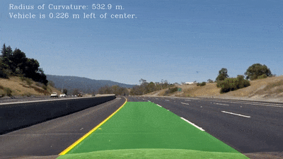

# Advanced Lane Finding Project
Self-Driving Car Engineer Nanodegree Program

---
## Project Details



This repository contains the project files for the Advanced Lane Lines Project in the Udacity Self-Driving Car Engineer Nanodegree.

In this project lane lines are detected from image and video data recorded from a front-facing camera on car on a highway.

The goals / steps of this project are the following:

1. Compute the camera calibration matrix and distortion coefficients given a set of chessboard images
1. Apply a distortion correction to raw images
1. Use color transforms, gradients, etc., to create a thresholded binary image
1. Apply a perspective transform to rectify binary image ("birds-eye view")
1. Detect lane pixels and fit to find the lane boundary
1. Determine the curvature of the lane and vehicle position with respect to center
1. Warp the detected lane boundaries back onto the original image
1. Output visual display of the lane boundaries and numerical estimation of lane curvature and vehicle position


In the following is description of how the goals/steps were addressed in the implementation.

---
## Implementation Details

### Camera Calibration

#### 1. Computation of camera matrix and distortion coefficients

The code for this step is contained in the `Section 1` of the IPython notebook located in "./P2-advanced-lane-lines.ipynb".

I start by preparing "object points", which will be the (x, y, z) coordinates of the chessboard corners in the world. Here I am assuming the chessboard is fixed on the (x, y) plane at z=0, such that the object points are the same for each calibration image.  Thus, `objp` is just a replicated array of coordinates, and `objpoints` will be appended with a copy of it every time I successfully detect all chessboard corners in a test image. `imgpoints` will be appended with the (x, y) pixel position of each of the corners in the image plane with each successful chessboard detection.

I then used the output `objpoints` and `imgpoints` to compute the camera calibration and distortion coefficients using the `cv2.calibrateCamera()` function.  I applied this distortion correction to the test image using the `cv2.undistort()` function and obtained this result on a chessboard image:

A total of 17 out of the 20 chessboard calibration images were succesful to use in the calibration procedure.


### Pipeline (single images)

#### 1. Example of a distortion-corrected image

In `Section 2` of `P2-advanced-lane-lines.ipynb` image distortation correction is implemented. The image below shows an example where distortation correction was applied to one of the highway test images. The `cv2.calibrateCamera()` function was used with the `objpoints` and `imgpoints` acquired in the camera calibration step. `cv2.calibrateCamera()` returns

* retval: root mean square (RMS) re-projection error. An RMS error of 1.0 means that, on average, each of these projected points is 1.0 px away from its actual position
* cameraMatrix: Output 3x3 floating-point camera matrix
* distCoeffs: Output vector of distortion coefficients of 4, 5, or 8 elements
* rvecs: Output vector of rotation vectors estimated for each pattern view
* tvecs: Output vector of translation vectors estimated for each pattern view

These values are then used with the `cv2.undistort()` function to undistort an image as seen below.


#### 2. Creating a thresholded binary image using Sobel and HLS colorspace

In `Section 3` of `P2-advanced-lane-lines.ipynb` a binary image is created. I used a combination of color and gradient thresholds to generate a binary image. The implementation extracts the HLS colorspace, where especially the S channel seems to highlight the lane lines quite well. A Sobel filter was applied followed by a custom thresholding to select relevant pixels. This was followed by a thresholding of the S channel of HLS. Finally, the two binary output were combined to produce the final output seen below.


#### 3. Perform perspective transform of binary image

In `Section 4` of `P2-advanced-lane-lines.ipynb` the code for performing perspective transform is implemented. It includes a function called `warp_img()` to perform the perspective transformation.  The `warp_img()` function takes as inputs an image (`img`), as well as source (`src_coord`) and destination (`dst_coord`) points. The source and destination points are hardcoded in the following manner by manually identifying specific points in the undistorted image:


```python
src_coord = np.float32([
    [837, 548],  # top right
    [1018, 667], # bottom right
    [281, 667],  # bottom left
    [454, 548]   # top left
])
dst_coord = np.float32([
    [1018, 548], # top right
    [1018, 667], # bottom right
    [281, 667],  # bottom left
    [281, 548],  # top left
])
```

<!-- This resulted in the following source and destination points:

| Source        | Destination   |
|:-------------:|:-------------:|
| 585, 460      | 320, 0        |
| 203, 720      | 320, 720      |
| 1127, 720     | 960, 720      |
| 695, 460      | 960, 0        | -->
<!--
I verified that my perspective transform was working as expected by drawing the `src` and `dst` points onto a test image and its warped counterpart to verify that the lines appear parallel in the warped image.

![alt text][image4]
-->

An example of a perspective corrected binary image is shown below. On the left you see the undistorted color image, and on the right is the corresponding binary image that have been correct to a birds-eye view


#### 4. Identifying lane line pixels and fiting their positions with a polynomial

In `Section 5` of `P2-advanced-lane-lines.ipynb` the lane line detection and polynomial fitting is implemented.

First I defined a function for detecting the lane pixels `find_lane_pixels()`. It takes in a undistorted binary image from the previous step, and it outputs detected pixels that are relevant to the right and left lane line. The lane lines are detected by finding histogram peaks at the lower part of the image and using a sliding window to move across the binary image. The two most prominent peaks in the histogram will be good indicators of the x-position of the base of the lane lines. I use that as a starting point for where to search for the lane lines. From that point, I use a sliding window, placed around the line centers, to find and follow the lines up to the top of the image frame as seen in the image below.

Then I implemented another function called `fit_polynomial()`, which also takes a binary image and then later calls `find_lane_pixels()` described above. It receives the relevant lane lines pixels from `find_lane_pixels()`. These x,y pixel values for the left and right lane line respectively, are then used for fitting a second order polynomial to each lane line. `fit_polynomial()` an image for visualization and the fitted polynomial parameters and pixels for each lane line.


#### 5. Calculating radius of curvature of the lane and the position of the vehicle with respect to center

In `Section 6` of `P2-advanced-lane-lines.ipynb` two functions were implemented for measuring the lane curvature and vehicle postion with respect to the center of the lane.

The function `measure_curvature_real()` takes in the pixel values for the left and right lane line. Then the pixel-to-meter ration `ym_per_pix` and `xm_per_pix` are defined to calculate the real world units transformed from pixel values, since until now everything has been pixel values. It is expected as per a standard that the lane width is approximately 3.7 meters and the tracking lenght of the lane is 30 meters.

* `ym_per_pix` = 30/720 # meters per pixel in y dimension
* `xm_per_pix` = 3.7/700 # meters per pixel in x dimension

The function `measure_offset_to_center()` calculates the offset to the center of the lane by taking the two fitted polynomials for each lane line and finding the x-coordinate where they intersect with the bottom of the image frame, i.e. at y_max. The center is then calculated by finding the center point between this two x-coordinates. Finally, the value is transformed from pixel-values to real-world values in meters, and then returned.


#### 6. Final lane plotted back down onto the road

In `Section 7` and `Section 8` of `P2-advanced-lane-lines.ipynb` three functions have been implemented two warp (transform) the detected lane lines and lane area back onto the original undistorted image and add text information about the lane curvature and car position on the lane.

`drawing_lane_lines()` takes an undistorted image, the binary warped image, the inverse perspective transform `M_inv`, and the lane lines pixel coordinates. `cv2.fillPoly` is used to draw the green lane area. Finally, `cv2.warpPerspective` is used to perspective transform the green lane area onto the undistorted image using the inverse perspective transform `M_inv`.

`drawing_lane_curvature_text()` implements a function to add text to the undistorted image. Here the lane curvature (mean of the left and right lane line) is added as well with the off center distance.

Finally, the function `plot_lane_lines_on_image()` is implemented, which puts the whole processing pipeline together. It takes in the original distorted video feed image and the does the following

1. Undistorts the image
1. Applies thresholding to produce a binary image
1. Applies a perspective transform to provide a birds-eye view of the road and lane lines
1. Detects the lane line pixels and fits two polynomials to the pixels
1. Calculates the lane curvature for each lane line
1. Calculates the off center distance of the car
1. Draws the lane area in green onto the original undistorted image
1. Adds text information about the mean lane curvature and off center distance

The final result is seen in the following image


---

## Video

A video of the final running algorithm can be found here: [output.mp4](./output.mp4)


---
## Discussion

The main issue encountered was in relation to thresholding, which affect the following steps in the pipeline. The implementation works well, but in certain areas the thresholding and hence the lane line detection may fail or become inaccurate. By adding a region of interesting to the processing pipeline a lot of noise can be removed from the input image. Here I would like to make it more robust.

---
## Author

Simon Bøgh